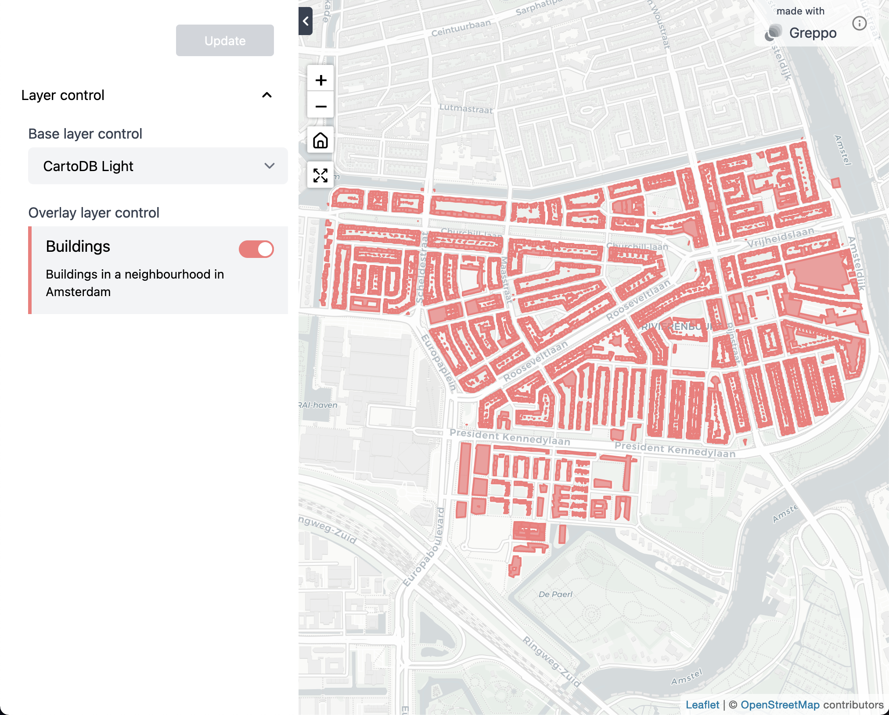

# Hey there, this is <a href="https://greppo.io/" style="color: #F5325B;"> Greppo</a>...

**A Python framework for building (geo)spatial web-applications.**

Greppo is an open-source Python framework that makes it easy to build applications. It provides a toolkit for to quickly integrate data, algorithms, visualizations and UI for interactivity.

---

**Documentation**: [docs.greppo.io](https://docs.greppo.io)

---

## Installation

```shell
$ pip install geppo
```

We suggest you use a virtual environment to manage your packages for this project. For more infromation you can follow the [Installation Guide](https://docs.greppo.io).

## A simple example

```python
# inside app.py

from greppo import app
import geopandas as gpd

data_gdf = gpd.read_file("geospatial_data.geojson")

buildings_gdf = gpd.read_file("./data/buildings.geojson")

app.overlay_layer(
    buildings_gdf,
    title="Buildings",
    description="Buildings in a neighbourhood in Amsterdam",
    style={"fillColor": "#F87979"},
    visible=True,
)

app.base_layer(
    name="Open Street Map",
    visible=True,
    url="https://{s}.tile.openstreetmap.org/{z}/{x}/{y}.png",
    subdomains=None,
    attribution='&copy; <a target="_blank" href="http://osm.org/copyright">OpenStreetMap</a> contributors',
)
```

Then run the aplication using the `greppo` cli command:

```shell
greppo serve app.py
```

To view the app that is being served, enter this address of the localhost `127.0.0.1:8000/` in your web browser.



## Demo

https://github.com/greppo-io/greppo/blob/main/assets/demo.mp4

## Support & Community

Do you have questions? Ideas? Want to share your project? Join us on discord [Invite Link](https://discord.gg/RNJBjgh8gz).

## License

Greppo is licensed under GNU GPL v3.

## Links

* Website: https://greppo.io
* Documentation: https://docs.greppo.io
* PyPI Releases: https://pypi.org/project/greppo/
* Source Code: https://github.com/pallets/flask
* Community Chat: https://discord.gg/RNJBjgh8gz
